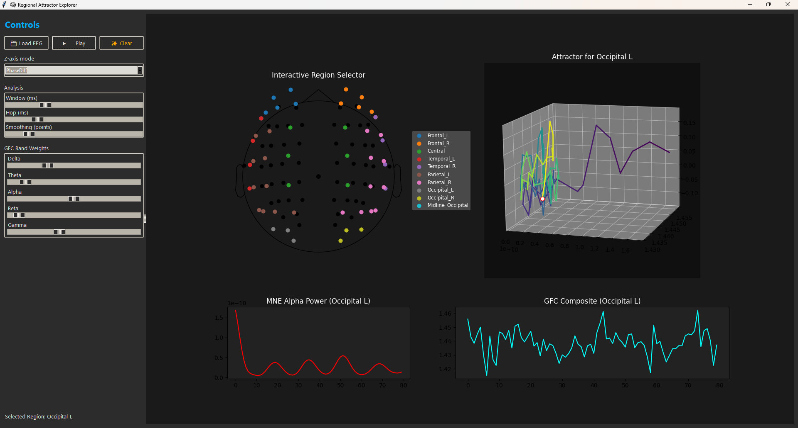

# Regional Attractor Explorer

Watch brain regions trace their own “state-space” loops.

This tool builds a 3D attractor per cortical region from ordinary EEG data. The attractor is defined by three orthogonal dimensions 
derived from the signal, revealing the dynamic interplay of neural oscillations.

-   **X**: Regional MNE alpha power (8–13 Hz)
-   **Y**: Regional Moiré composite (a multi-band, band-weighted root mean square)
-   **Z**: The phase relationship between the two (e.g., Phase Slip Rate, Phase Difference, etc.)
-   **Color**: An optional synchrony metric (e.g., Phase-Locking Value)

It lets you click cortical regions (frontal, temporal, parietal, occipital, midline), tune band weights, and watch repeatable coordination
motifs emerge: bursts, brief phase-locks, slips, and re-locks—which are especially vivid in occipital alpha rhythms.

---

## ✨ Features

-   **Interactive region selector**: Click dots on the scalp map to switch between brain regions.
-   **Persistent 3D attractor**: The trajectory's tail persists over time and does not auto-clear, allowing you to see the full evolution of the state-space dynamics.
-   **Multiple Z/Color modes**: Choose from PhaseSlipRate, PhaseDiff, DelayDiff, PLV, and VelocityMag to explore different aspects of the signal relationship.
-   **Live band weight tuning**: Adjust per-band weights (δ, θ, α, β, γ) with sliders and see the attractor update in real-time.
-   **Analysis controls**: Fine-tune the analysis window, hop length, and display smoothing.
-   **Playback controls**: Play, pause, and clear the attractor visualization.
-   **Clean UI**: A dark, minimalist interface with a separate control pane keeps the 3D visualization large and centered.

---

## 🚀 Quick start

1.  **Set up the environment** (Python ≥3.9 recommended):
    ```bash
    python -m venv .venv
    # On macOS/Linux
    . .venv/bin/activate
    # On Windows
    .venv\Scripts\activate
    ```

2.  **Install dependencies**: `tkinter` is included with most Python distributions on Windows/macOS. On some Linux distros,
3.   you may need to install it separately (e.g., `sudo apt-get install python3-tk`).
    ```bash
    pip install -U mne numpy scipy matplotlib
    ```

4.  **Run the application**:
    ```bash
    python regional_attractor_explorer.py
    ```

5.  **Explore**: Load an EEG file (.edf, .bdf, .vhdr, .set, .fif), click **Play**, then click a region on the scalp map.

> **Tip**: Try **Occipital** regions first and toggle **Z = PhaseSlipRate** or **PhaseDiff**, and **Color = PLV**.

---

## 🧠 How it works (signal recipe)

Per analysis window (e.g., 1000 ms; hop 40 ms), the script calculates the following for the selected region *R*:

### X — MNE alpha power (scalar)

The **X-axis** represents the average alpha power. It's calculated by taking the Welch PSD for each channel in the region,
averaging the power in the alpha band (8–13 Hz), and then averaging this value across all channels in the region.

$X = \frac{1}{|R|}\sum_{c\in R}\;\frac{1}{|F_\alpha|}\sum_{f\in F_\alpha} P_c(f)$

A regional alpha time series is also constructed for phase analysis:

$x_\alpha(t)=\frac{1}{|R|}\sum_{c\in R} \text{BPF}_{8–13}\{x_c(t)\}$

### Y — Moiré composite (scalar)

The **Y-axis** is a "Moiré composite" that rises when multi-band activity in the region becomes coherent and interferes constructively.
For each band $b\in\{\delta,\theta,\alpha,\beta,\gamma\}$ with a user-defined weight $w_b$:

1.  The regional signal is band-passed, and channels are averaged to create a band-specific time series, $s_b(t)$.
2.  Within the analysis window, $s_b(t)$ is z-normalized: $\tilde{s}_b(t)=(s_b-\mu_b)/\sigma_b$.
3.  A composite signal $c(t)$ is formed by the weighted sum across bands: $c(t)=\sum_b w_b \tilde{s}_b(t)$.
4.  The final **Y** value is the root mean square (RMS) of this composite signal within the window:

    $Y = \sqrt{\tfrac{1}{N}\sum_t c(t)^2}$

### Z / Color — phase & timing between $x_\alpha(t)$ and $c(t)$

The **Z-axis** and **Color** map a timing or phase relationship between the alpha time series ($x_\alpha(t)$) and the Moiré composite ($c(t)$).
Let $\phi_\alpha$ and $\phi_c$ be their instantaneous phases (via the Hilbert transform) and $\Delta\phi = \phi_\alpha - \phi_c$.

-   **PhaseDiff** (rad): The circular mean of $\Delta\phi$.
-   **PhaseSlipRate** (rad/s): The mean derivative of the unwrapped phase difference, $\Delta\phi$.
-   **PLV** (0–1): The Phase-Locking Value, a measure of synchrony: $|\tfrac{1}{N}\sum e^{i\Delta\phi}|$.
-   **DelayDiff** (s): The time lag that maximizes the short-window cross-correlation between the two signals.

The final 3D curve is the trajectory of **(X, Y, Z)** points over time, with each segment colored by the chosen metric.

---

## 🕹️ Controls

-   **File**: `Load EEG`, `Play`, `Pause`, `Clear`.
-   **Modes**:
    -   `Z-axis mode`: Selects the metric for the vertical axis.
    -   `Color mode`: Selects the metric for coloring the trajectory.
-   **Analysis**:
    -   `Window (ms)`: Length of the analysis window (e.g., 750–1200).
    -   `Hop (ms)`: Step size between windows (e.g., 25–50).
    -   `Smoothing (points)`: Number of points for display smoothing (visual only).
-   **GFC Band Weights**: Sliders for δ, θ, α, β, γ weights (e.g., a good starting point is θ≈0.2, α≈1.0, β≈0.1).
-   **Region Selector**: Click the colored dots on the scalp map to select a region. A legend shows the region names.

---

## 🧪 Suggested demos

-   **Occipital (eyes relaxed/closed)**: Set `Z = PhaseSlipRate` and `Color = PLV`. Watch the classic "lock → slip → re-lock" cycles.
-   **Temporal**: Investigate the influence of muscle artifacts (EMG) by lowering the β and γ weights and observing the change in the attractor.
-   **Lead/Lag**: Set `Z = DelayDiff` to visualize which signal (alpha or the composite) is leading or lagging the other.

---

## 📂 Supported file types

The application uses MNE-Python for file loading and supports numerous formats, including:

-   BrainVision (.vhdr)
-   EDF/BDF (.edf, .bdf)
-   EEGLAB (.set)
-   FIF (.fif)

By default, an average reference is applied, and the data is band-pass filtered between 1–50 Hz.

---

## ⚠️ Channel locations / montage

If you see a warning like `DigMontage is only a subset…`, it means some channel names in your file did not match the standard montage used by the application (e.g., your file has `Fp1` but the montage expects `FP1`).

-   **Why it matters**: If channels are dropped, comparisons between regions can be biased because some regions will be defined by fewer channels than others.
-   **Fixes**:
    1.  Ensure channel names in your data file match a standard montage (typically uppercase, with no special characters like dots).
    2.  Use a standard MNE montage (like `standard_1005`) when setting up your data to ensure names align.
    3.  You can optionally modify the code to print the count of "channels per region" to the status bar to verify correct channel mapping.

---

## 🛠️ Requirements

-   Python 3.9+
-   mne, numpy, scipy, matplotlib
-   tkinter (usually bundled with Python; on some Linux distributions, install with `sudo apt-get install python3-tk`)

**Install command:**
```bash
pip install -U mne numpy scipy matplotlib
