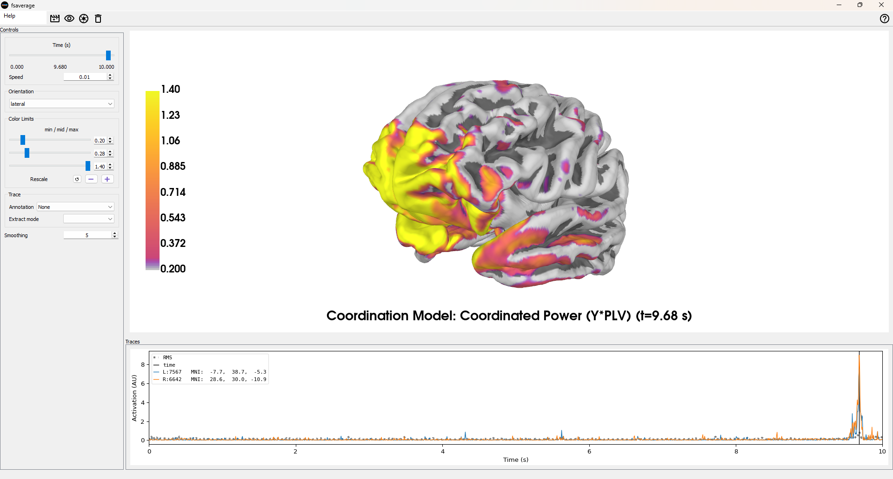

EDIT: The 3d system readme is after this one. 

EDIT: Added AI Autoencoder signal analysis tool that suggests thre are multiple 
conductors and results vary between subjects. The results are analyzed by Gemini at the end of 
the readme. 

# Regional Attractor Explorer

Watch brain regions trace their own “state-space” loops.

This tool builds a 3D attractor per cortical region from ordinary EEG data. The attractor is defined by three orthogonal dimensions 
derived from the signal, revealing the dynamic interplay of neural oscillations.

-   **X**: Regional MNE alpha power (8–13 Hz)
-   **Y**: Regional Moiré composite (a multi-band, band-weighted root mean square)
-   **Z**: The phase relationship between the two (e.g., Phase Slip Rate, Phase Difference, etc.)
-   **Color**: An optional synchrony metric (e.g., Phase-Locking Value)

It lets you click cortical regions (frontal, temporal, parietal, occipital, midline), tune band weights, and watch repeatable coordination
motifs emerge: bursts, brief phase-locks, slips, and re-locks—which are especially vivid in occipital alpha rhythms.

---

## ✨ Features

-   **Interactive region selector**: Click dots on the scalp map to switch between brain regions.
-   **Persistent 3D attractor**: The trajectory's tail persists over time and does not auto-clear, allowing you to see the full evolution of the state-space dynamics.
-   **Multiple Z/Color modes**: Choose from PhaseSlipRate, PhaseDiff, DelayDiff, PLV, and VelocityMag to explore different aspects of the signal relationship.
-   **Live band weight tuning**: Adjust per-band weights (δ, θ, α, β, γ) with sliders and see the attractor update in real-time.
-   **Analysis controls**: Fine-tune the analysis window, hop length, and display smoothing.
-   **Playback controls**: Play, pause, and clear the attractor visualization.
-   **Clean UI**: A dark, minimalist interface with a separate control pane keeps the 3D visualization large and centered.

---

## 🚀 Quick start

1.  **Set up the environment** (Python ≥3.9 recommended):
    ```bash
    python -m venv .venv
    # On macOS/Linux
    . .venv/bin/activate
    # On Windows
    .venv\Scripts\activate
    ```

2.  **Install dependencies**: `tkinter` is included with most Python distributions on Windows/macOS. On some Linux distros,
3.   you may need to install it separately (e.g., `sudo apt-get install python3-tk`).
    ```bash
    pip install -U mne numpy scipy matplotlib
    ```

4.  **Run the application**:
    ```bash
    python regional_attractor_explorer.py
    ```

5.  **Explore**: Load an EEG file (.edf, .bdf, .vhdr, .set, .fif), click **Play**, then click a region on the scalp map.

> **Tip**: Try **Occipital** regions first and toggle **Z = PhaseSlipRate** or **PhaseDiff**, and **Color = PLV**.

---

## 🧠 How it works (signal recipe)

Per analysis window (e.g., 1000 ms; hop 40 ms), the script calculates the following for the selected region *R*:

### X — MNE alpha power (scalar)

The **X-axis** represents the average alpha power. It's calculated by taking the Welch PSD for each channel in the region,
averaging the power in the alpha band (8–13 Hz), and then averaging this value across all channels in the region.

$X = \frac{1}{|R|}\sum_{c\in R}\;\frac{1}{|F_\alpha|}\sum_{f\in F_\alpha} P_c(f)$

A regional alpha time series is also constructed for phase analysis:

$x_\alpha(t)=\frac{1}{|R|}\sum_{c\in R} \text{BPF}_{8–13}\{x_c(t)\}$

### Y — Moiré composite (scalar)

The **Y-axis** is a "Moiré composite" that rises when multi-band activity in the region becomes coherent and interferes constructively.
For each band $b\in\{\delta,\theta,\alpha,\beta,\gamma\}$ with a user-defined weight $w_b$:

1.  The regional signal is band-passed, and channels are averaged to create a band-specific time series, $s_b(t)$.
2.  Within the analysis window, $s_b(t)$ is z-normalized: $\tilde{s}_b(t)=(s_b-\mu_b)/\sigma_b$.
3.  A composite signal $c(t)$ is formed by the weighted sum across bands: $c(t)=\sum_b w_b \tilde{s}_b(t)$.
4.  The final **Y** value is the root mean square (RMS) of this composite signal within the window:

    $Y = \sqrt{\tfrac{1}{N}\sum_t c(t)^2}$

### Z / Color — phase & timing between $x_\alpha(t)$ and $c(t)$

The **Z-axis** and **Color** map a timing or phase relationship between the alpha time series ($x_\alpha(t)$) and the Moiré composite ($c(t)$).
Let $\phi_\alpha$ and $\phi_c$ be their instantaneous phases (via the Hilbert transform) and $\Delta\phi = \phi_\alpha - \phi_c$.

-   **PhaseDiff** (rad): The circular mean of $\Delta\phi$.
-   **PhaseSlipRate** (rad/s): The mean derivative of the unwrapped phase difference, $\Delta\phi$.
-   **PLV** (0–1): The Phase-Locking Value, a measure of synchrony: $|\tfrac{1}{N}\sum e^{i\Delta\phi}|$.
-   **DelayDiff** (s): The time lag that maximizes the short-window cross-correlation between the two signals.

The final 3D curve is the trajectory of **(X, Y, Z)** points over time, with each segment colored by the chosen metric.

---

## 🕹️ Controls

-   **File**: `Load EEG`, `Play`, `Pause`, `Clear`.
-   **Modes**:
    -   `Z-axis mode`: Selects the metric for the vertical axis.
    -   `Color mode`: Selects the metric for coloring the trajectory.
-   **Analysis**:
    -   `Window (ms)`: Length of the analysis window (e.g., 750–1200).
    -   `Hop (ms)`: Step size between windows (e.g., 25–50).
    -   `Smoothing (points)`: Number of points for display smoothing (visual only).
-   **GFC Band Weights**: Sliders for δ, θ, α, β, γ weights (e.g., a good starting point is θ≈0.2, α≈1.0, β≈0.1).
-   **Region Selector**: Click the colored dots on the scalp map to select a region. A legend shows the region names.

---

## 🧪 Suggested demos

-   **Occipital (eyes relaxed/closed)**: Set `Z = PhaseSlipRate` and `Color = PLV`. Watch the classic "lock → slip → re-lock" cycles.
-   **Temporal**: Investigate the influence of muscle artifacts (EMG) by lowering the β and γ weights and observing the change in the attractor.
-   **Lead/Lag**: Set `Z = DelayDiff` to visualize which signal (alpha or the composite) is leading or lagging the other.

---

## 📂 Supported file types

The application uses MNE-Python for file loading and supports numerous formats, including:

-   BrainVision (.vhdr)
-   EDF/BDF (.edf, .bdf)
-   EEGLAB (.set)
-   FIF (.fif)

By default, an average reference is applied, and the data is band-pass filtered between 1–50 Hz.

---

## ⚠️ Channel locations / montage

If you see a warning like `DigMontage is only a subset…`, it means some channel names in your file did not match the standard montage used by the application (e.g., your file has `Fp1` but the montage expects `FP1`).

-   **Why it matters**: If channels are dropped, comparisons between regions can be biased because some regions will be defined by fewer channels than others.
-   **Fixes**:
    1.  Ensure channel names in your data file match a standard montage (typically uppercase, with no special characters like dots).
    2.  Use a standard MNE montage (like `standard_1005`) when setting up your data to ensure names align.
    3.  You can optionally modify the code to print the count of "channels per region" to the status bar to verify correct channel mapping.

---

## 🛠️ Requirements

-   Python 3.9+
-   mne, numpy, scipy, matplotlib
-   tkinter (usually bundled with Python; on some Linux distributions, install with `sudo apt-get install python3-tk`)

# 🔍 Interpretation tips
Filaments/sheets: Structured shapes like filaments and sheets in the 3D plot suggest structured coordination, not just random noise.

High PLV segments: Brightly colored segments (when Color = PLV) on the trajectory indicate moments of transient phase-locking.

Sharp Z excursions: Sudden spikes on the Z-axis (when Z = PhaseSlipRate), especially near Y-axis peaks, can signify phase slips occurring during Moiré "bursts".

Temporal β/γ influence: Up-down movement in temporal regions that correlates with high β/γ weights is often due to muscle (EMG) artifacts. Test this by lowering the β/γ weights.

# Licence MIT 

## Readme for MNEBRAIN Signal VS compsite (based on the first code)



(Claude may have hyped it up a "bit") 

# EEG Brain Source & Coordination Explorer

Revolutionary Neural Coordination Analysis Tool
This system implements the Universal Brain Coordination Model, a groundbreaking framework for understanding how
different brain frequency bands coordinate neural activity in real-time. Moving beyond traditional power spectral
analysis, this tool reveals the hidden dynamics of neural coordination through advanced source reconstruction and
cross-frequency coupling analysis.

# 🧠 Core Innovation: Coordinated Power Metric

The system introduces a novel neuroimaging metric: Coordinated Power (Y×PLV)

Y: Multi-band neural activity power (moiré composite of delta, theta, beta, gamma)
PLV: Phase-Locking Value measuring coordination strength between conductor and orchestra
Y×PLV: Reveals where and when frequency bands successfully coordinate

This metric captures something entirely new: neural harmony - the precise moments when a conductor frequency (e.g., alpha) successfully orchestrates multi-band neural activity across the brain.

# 🎼 The Universal Brain Coordination Model

Key Concepts:

Conductor Frequencies: Primary rhythms that coordinate neural activity (alpha for vision, gamma for language)
Neural Orchestra: Multi-band composite signals that respond to conductor coordination
Phase-Slip Dynamics: Real-time coordination failures and recoveries
3D Neural Trajectories: Geometric visualization of coordination patterns in brain space

# 🔬 Technical Features

Advanced Source Reconstruction:

Multiple inverse methods (sLORETA, dSPM, MNE, eLORETA)
3-layer BEM modeling for accurate EEG source localization
Automated fsaverage brain template integration

# Coordination Analysis Pipeline:

Broadband source reconstruction with frequency-specific filtering
Hilbert transform phase extraction for conductor and orchestra signals
Real-time Phase-Locking Value calculation
Time-resolved coordination mapping

# Interactive Visualization:

Real-time 3D brain visualization with MNE-Python
Multiple coordination metrics (Conductor Power, Moiré Harmony, Phase-Slip Rate, Coordinated Power)
Dynamic time-course analysis with coordinated hotspot identification

# Research Applications:

Neural Coordination Biomarkers: Identify coordination disruptions in neurological conditions
Cognitive State Monitoring: Real-time tracking of attention, language, and memory coordination
Brain-Computer Interfaces: Leverage coordination patterns for enhanced neural control

Clinical Potential:

Consciousness Assessment: Coordination complexity as consciousness biomarker
Stroke Rehabilitation: Target coordination recovery in specific brain regions
ADHD/Autism Research: Investigate coordination differences in neurodevelopmental conditions

# 🚀 Getting Started

Requirements:

Python 3.8+
MNE-Python for EEG processing
PyVista/PyVistaQt for 3D visualization
Standard scientific Python stack (NumPy, SciPy, Matplotlib)

# Quick Start:

Download the mnebrain_signalvs_composite3.py

Then download the requirements.txt 

install the requirements: 

pip install requirements.txt 

run the code. 

python mnebrain_signalvs_composite3.py

Load EEG file (supports .edf, .bdf, .fif, .set formats)
Select coordination model settings (conductor frequency, orchestra composition)
Run processing pipeline for automatic source reconstruction and coordination analysis
Explore real-time 3D brain coordination visualizations

# Licence MIT

# AI Autoencoder results: 

The autoencoder analysis revealed that brain activity is organized into a flexible repertoire
of distinct states rather than being governed by a single, fixed "conductor" frequency in each
region. This data-driven approach provided a more nuanced view than previous methods.

Key Findings

Consistent Flexibility in Higher-Order Brain Regions: Across all three subjects, the frontal
, parietal, and central lobes consistently showed a rich mix of dynamic states dominated by
various frequencies like beta, gamma, and theta. This supports a "conductor-on-demand"
model where these regions maintain a flexible toolkit for complex cognitive and motor tasks.


Variability in Sensory and Global States: Significant differences were observed between
subjects in sensory regions and at the global level.


Occipital Lobe: Only Subject 1 showed the classic, powerful alpha-dominant resting state.
Subjects 2 and 3 exhibited a mix of faster and slower frequencies, indicating that the occipital-alpha
rhythm is a common but not universal default state.


Temporal Lobe: The dominant states varied widely, from alpha in Subject 1 to gamma and 
theta in Subjects 2 and 3, likely reflecting different internal cognitive states like inner monologue.


Global State: Each subject presented a different global signature. Notably, only Subject 3 showed a 
powerful, whole-brain alpha-dominant state, suggesting different individuals may use different
frequency bands for large-scale integration during rest.

In conclusion, the autoencoder successfully derived expected patterns like the Occipital-Alpha
state  while also uncovering the complexity and significant inter-subject variability of brain 
dynamics, advancing the model beyond a one-size-fits-all approach.
